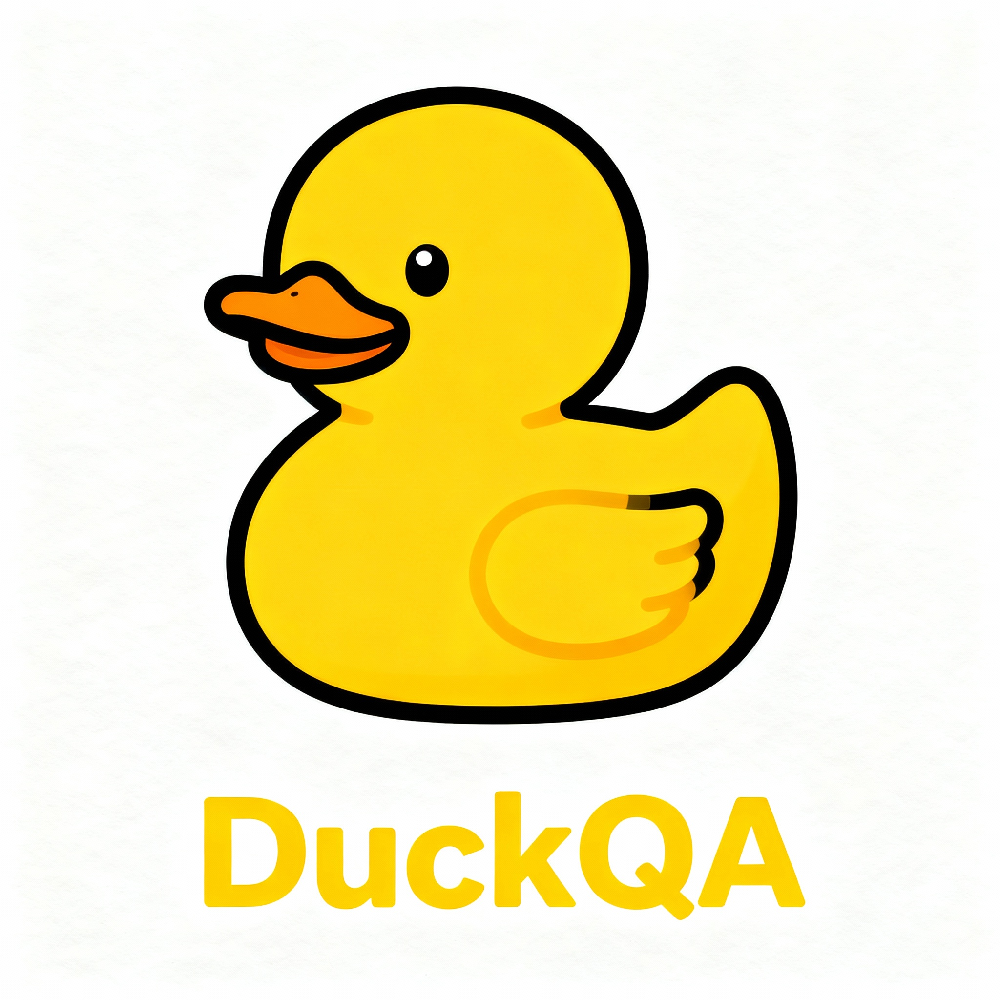

# DuckQA

DuckQA is a fun and powerful tool that enables you to chat with your software/hardware documentation. As long as your documents are indexable, DuckQA can build an index and let you interact with them conversationally to solve your problems efficiently.

> [!Note]
> Inspired by the idea that "doc" sounds like "duck," DuckQA features a minimalistic and expressive rubber duck mascot to make documentation interaction enjoyable.

## Features

- Chat with any documentation
- Interact naturally to get precise answers
- Minimal setup for any project
- Supports various document formats
- Build upon existing LLMs and agentic frameworks

Make your documentation a conversational assistant with DuckQA!